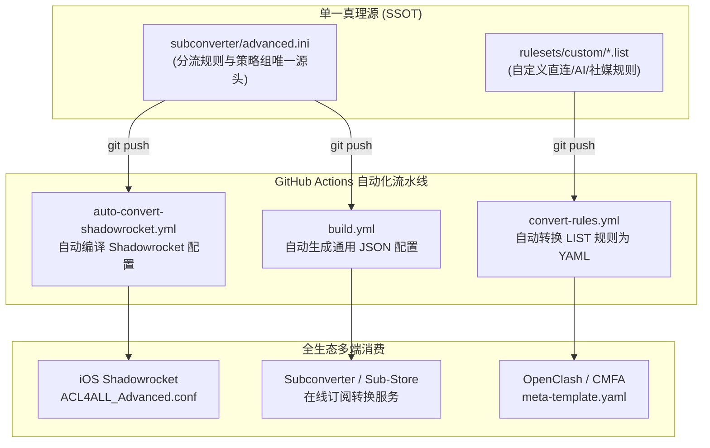

# ACL4ALL

<p align="center">
  
  
  
</p>

> **ACL4ALL** 是一套面向全平台的进阶分流规则与策略组编排框架。遵循 **KISS 原则** 与 **单一数据源 (SSOT)** 设计哲学，实现 OpenClash、Clash Verge (CMFA)、Shadowrocket 及 Sing-box 的**全生态策略 100% 对齐与自动化同步**。

---

## 🌟 核心理念与架构优势

1. **一处维护，各端同步 (GitOps / SSOT)**：
   - 规则与策略组唯一的真理源为 [`subconverter/advanced.ini`](subconverter/advanced.ini)。
   - 通过 GitHub Actions 自动化流水线，自动无损平移编译为 iOS Shadowrocket 专用的 [`ACL4ALL_Advanced.conf`](Shadowrocket/config/ACL4ALL_Advanced.conf) 与标准 JSON/YAML 规则集。
2. **51 个统一策略组 & 50 层细分分流**：
   - 包含流媒体、全链路 AI 服务、海外政企、社媒 CDN 优化、私有直连与精准地区路由。
3. **端云解耦与隐私零泄露 (Security First)**：
   - **云端公有层**：仅托管通用策略组逻辑与纯净规则集，严禁任何节点公网 IP/端口/密码或私有凭据进入公开仓库。
   - **本地私有层**：设备专有 CA 私钥、局域网私有 DNS、住宅出口凭据及自建 VPS 节点通过本地模块或私有 Sub-Store 管道注入，实现绝对的安全隔离。

---

## 🔄 自动化工作流与数据流向



---

## 🚀 快速订阅使用指南

### 1. iOS Shadowrocket (小火箭)

在 Shadowrocket 中依次点击 **配置 ➔ 远程文件 ➔ ＋**，填入以下订阅 URL：

```text
https://raw.githubusercontent.com/whjstc/ACL4ALL/main/Shadowrocket/config/ACL4ALL_Advanced.conf
```

> 💡 **关于 `.sgmodule`（Shadowrocket 专属私有模块）：**
> * `.sgmodule` 是 Shadowrocket（及 Surge）特有的模块扩展机制。
> * **为什么需要它？**
>   因为本仓库是公开的，主配置文件只包含公共通用的分流规则与策略组，**严禁存放您的个人私有凭据**（如本机的 HTTPS 解密 CA 私钥、家庭局域网特定的 DNS 劫持映射等）。
> * **端云解耦最佳实践：**
>   将您的私有凭据保存在本地的 `iPhone_Private.sgmodule` 模块中，在 Shadowrocket 的「模块」页面开启。它会像插件一样无缝叠加在主配置上生效。这样无论主配置如何从 GitHub 在线自动更新，您的**本地私有证书与家庭 Wi-Fi DNS 映射永不丢失、永不泄露**！

### 2. Subconverter (订阅转换)

在任意自建或公共 Subconverter 服务中，远程配置 (Remote Config) 填入：

```text
https://cdn.jsdelivr.net/gh/whjstc/ACL4ALL@main/subconverter/advanced.ini
```

### 3. OpenClash / CMFA / Mihomo

可直接配合自建 [Sub-Store](https://github.com/sub-store-org/Sub-Store) 载入节点，并应用 [`clash/meta-template.yaml`](clash/meta-template.yaml) 模板，获得完全一致的分流体验。

---

## 🧭 统一策略组矩阵 (全量 51 个)

所有客户端（OpenClash / CMFA / Shadowrocket）保持完全统一的命名规范与层级体验：

| 分类 | 策略组名称 |
| :--- | :--- |
| **核心与选择** | `🚀 手动选择`、`🇭🇰 香港节点`、`🗿 专属节点`、`🏠 住宅出口`、`🔗 链式中转`、`♻️ 自动选择` |
| **AI 矩阵** | `🤖 AI服务`、`🤖 ChatGPT`、`🤖 Copilot` |
| **社交与通讯** | `🌐 社交媒体`、`📡 社媒CDN`、`📲 电报消息`、`💬 即时通讯` |
| **流媒体** | `📹 YouTube`、`🎵 YouTube Music`、`🎥 Netflix`、`🎥 DisneyPlus`、`🎥 HBO`、`🎥 PrimeVideo`、`🎥 AppleTV+`、`🎥 Emby`、`🎻 Spotify`、`📺 Bahamut` |
| **系统与开发** | `🚀 GitHub`、`🍎 苹果服务`、`Ⓜ️ 微软服务`、`🔍 谷歌服务`、`📢 谷歌FCM` |
| **电商与娱乐** | `🎮 Steam`、`🎮 游戏平台`、`🛒 国外电商`、`🌎 国外媒体`、`🎶 TikTok` |
| **检测与合规** | `🌐 网络检测`、`🏛️ 海外政府` |
| **地区分组 (12区)** | `🇺🇸 美国节点`、`🇯🇵 日本节点`、`🇸🇬 新加坡节点`、`🇼🇸 台湾节点`、`🇰🇷 韩国节点`、`🇨🇦 加拿大节点`、`🇬🇧 英国节点`、`🇫🇷 法国节点`、`🇩🇪 德国节点`、`🇳🇱 荷兰节点`、`🇹🇷 土耳其节点`、`🌐 其他地区` |
| **直连与兜底** | `🎯 全球直连`、`🔀 非标端口`、`🐟 遵循规则`、`🐟 漏网之鱼` |

---

## 📁 仓库目录结构

```text
ACL4ALL/
├── .github/workflows/          # 自动化 CI/CD 流水线
│   ├── auto-convert-shadowrocket.yml # INI ➔ Shadowrocket 自动编译
│   ├── convert-rules.yml       # LIST ➔ YAML 自动转换
│   └── build.yml               # INI ➔ JSON 自动编译
│
├── subconverter/               # 唯一真理源 (SSOT)
│   ├── advanced.ini            # 进阶全生态分流主模板
│   └── basic.ini               # 极简备用模板
│
├── Shadowrocket/               # Shadowrocket 产物库
│   ├── config/
│   │   └── ACL4ALL_Advanced.conf # 自动生成的进阶配置文件
│   ├── modules/                # Shadowrocket 专有模块 (.sgmodule)
│   └── scripts/                # 专用重写脚本
│
├── clash/                      # Clash Meta / Mihomo 体系
│   └── meta-template.yaml      # 全量对齐模板
│
├── rulesets/                   # 自定义规则集 (.list / .yaml)
│   └── custom/                 # Tailscale打洞/私有直连/AI全链路/社媒防风控等
│
└── scripts/                    # 工具链
    ├── ini2conf.py             # 核心转换引擎
    └── validate_config.py      # 三方交叉一致性校验器
```

---

## 🛠️ 本地校验工具

项目内置纯 Python 标准库实现的校验工具，用于核验配置文件合法性与三端一致性：

```bash
python3 scripts/validate_config.py
```

---

## 🔒 隐私与开源安全承诺

本仓库完全开源，严格遵循隐私零泄露原则：
1. 仓库中**严禁且绝无**任何机场订阅、真实节点服务器 IP、端口、密码、UUID 或私钥；
2. 敏感私有节点请通过本地自建的 Sub-Store 或私有模块（`.sgmodule`）进行链式拼接。

---

## 📄 许可证与致谢

- 遵循 [MIT License](LICENSE) 开源协议。
- 规则集与架构灵感参考：
  - [ACL4SSR/ACL4SSR](https://github.com/ACL4SSR/ACL4SSR)
  - [blackmatrix7/ios_rule_script](https://github.com/blackmatrix7/ios_rule_script)
  - [MetaCubeX/meta-rules-dat](https://github.com/MetaCubeX/meta-rules-dat)
  - [Aethersailor/Custom_OpenClash_Rules](https://github.com/Aethersailor/Custom_OpenClash_Rules)
